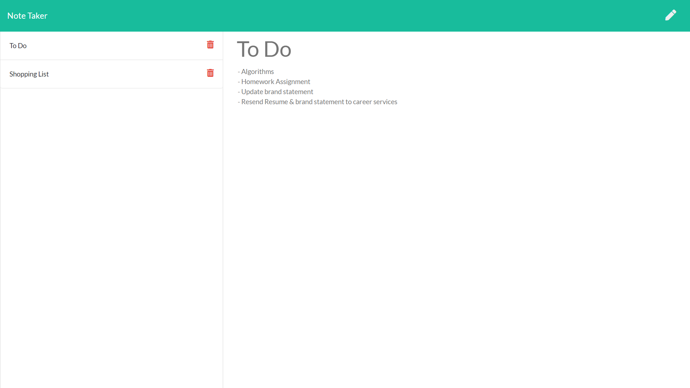

        

# Note-Taker
A node app using an Express server & a json file to save personal notes.

#### [Deployed App](https://evening-ocean-95695.herokuapp.com/)

## Concept
AS A user, I want to be able to write and save notes
I WANT to be able to delete notes I've written before
SO THAT I can organize my thoughts and keep track of tasks I need to complete

## Installation and Usage
1. Install the required modules by typing "npm install" or "npm i" using your code editor terminal; must be at the same level as the package.json.
2. Run the app by typing "node server.js" or "node server."
3. The console log will display " Server listening on: http://localhost:3000 ."
4. You can hold control and click on the address to go directly to the note taker landing page.
5. From the landing page, click "get started," to be re-directed to the user interface.
6. The user then can type the title, note content, and hit the save icon on the upper right (note the icon will only appear after there is content inputted).
8. The user can review the saved notes by clicking the note title populated on the left side of the screen. 
9. If the user is inspired to write another note while reviewing a note, click the pencil in the upper right corner and a new note form will appear.
10. The user can delete specific notes by hitting the delete icon to the right of each note.

## Tech Utilized
* HTML
* CSS
* Javascript
* jQuery
* Bootstrap
* Font Awesome
* Node
* NPM
* Express
* Fs

## Future Development
* Add an edit feature so users can update their notes.
* Update user interface to be more mobile friendly.
* Add an option to save notes to specific collections (ie. school, work, home, etc.)
* Add a login to the landing page to keep notes private or to allow multiple users to keep notes on device.

## Credits
Front end was provided by Trilogy Education Services as a part of their Coding Bootcamp Curriculum. 

## License

MIT License

Copyright (c) 2020 Laurie J Schroeder

Permission is hereby granted, free of charge, to any person obtaining a copy
of this software and associated documentation files (the "Software"), to deal
in the Software without restriction, including without limitation the rights
to use, copy, modify, merge, publish, distribute, sublicense, and/or sell
copies of the Software, and to permit persons to whom the Software is
furnished to do so, subject to the following conditions:

The above copyright notice and this permission notice shall be included in all
copies or substantial portions of the Software.

THE SOFTWARE IS PROVIDED "AS IS", WITHOUT WARRANTY OF ANY KIND, EXPRESS OR
IMPLIED, INCLUDING BUT NOT LIMITED TO THE WARRANTIES OF MERCHANTABILITY,
FITNESS FOR A PARTICULAR PURPOSE AND NONINFRINGEMENT. IN NO EVENT SHALL THE
AUTHORS OR COPYRIGHT HOLDERS BE LIABLE FOR ANY CLAIM, DAMAGES OR OTHER
LIABILITY, WHETHER IN AN ACTION OF CONTRACT, TORT OR OTHERWISE, ARISING FROM,
OUT OF OR IN CONNECTION WITH THE SOFTWARE OR THE USE OR OTHER DEALINGS IN THE
SOFTWARE.